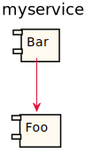
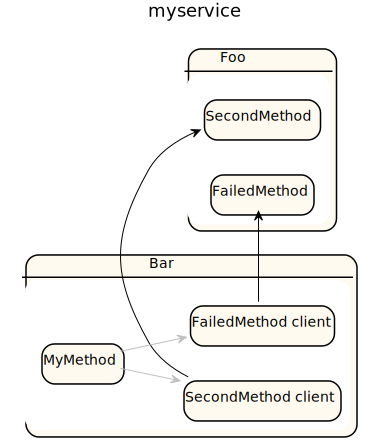

# myservice

| Package |
| - | 
[commypackagename](commypackagename/README.md)|
[commypackagename2](commypackagename2/README.md)|

Integration diagram:

Integration diagram with end point analysis:

