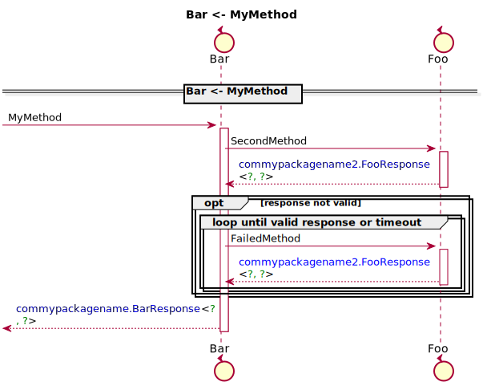
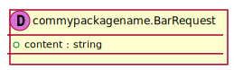
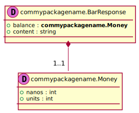

[Back](../README.md)
# Package commypackagename

## Index
| Service Name | Method |
| - | - | 
| Bar | [MyMethod](#Bar-MyMethod) |]

---

## Bar MyMethod

### Sequence Diagram

### Request types

### Response types

---

