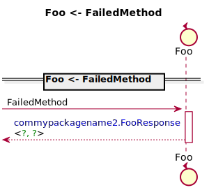
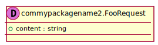
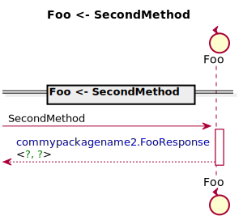

[Back](../README.md)
# Package commypackagename2

## Index
| Service Name | Method |
| - | - | 
| Foo | [FailedMethod](#Foo-FailedMethod) |
| Foo | [SecondMethod](#Foo-SecondMethod) |]

---

## Foo FailedMethod

### Sequence Diagram

### Request types

### Response types

---

## Foo SecondMethod

### Sequence Diagram

### Request types

### Response types

---

